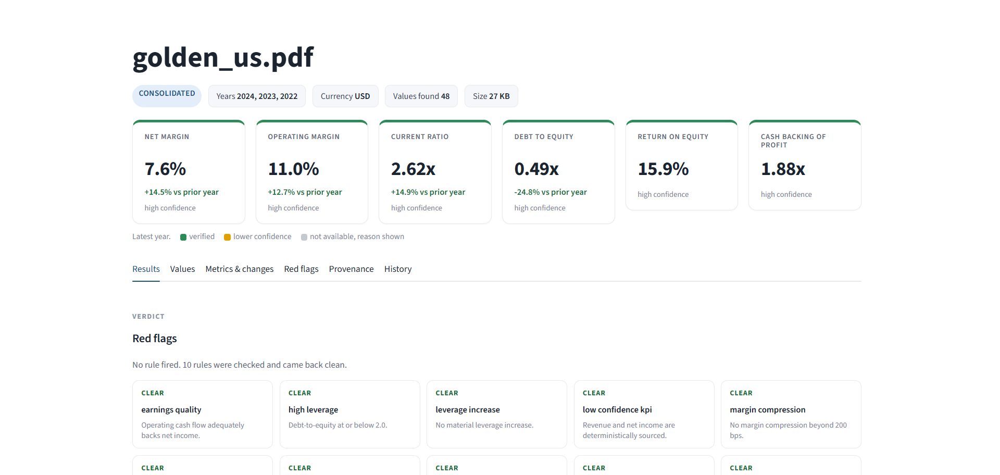
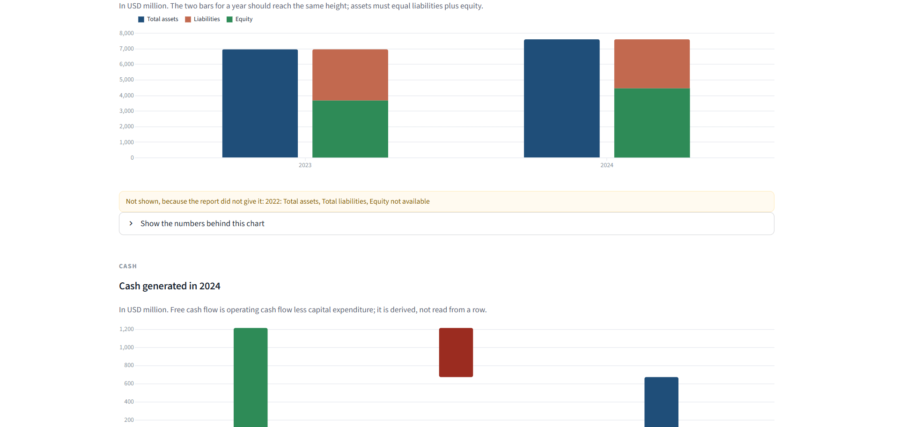
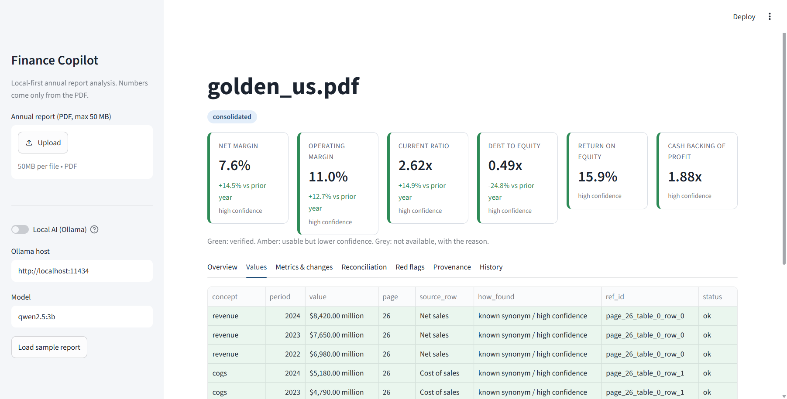
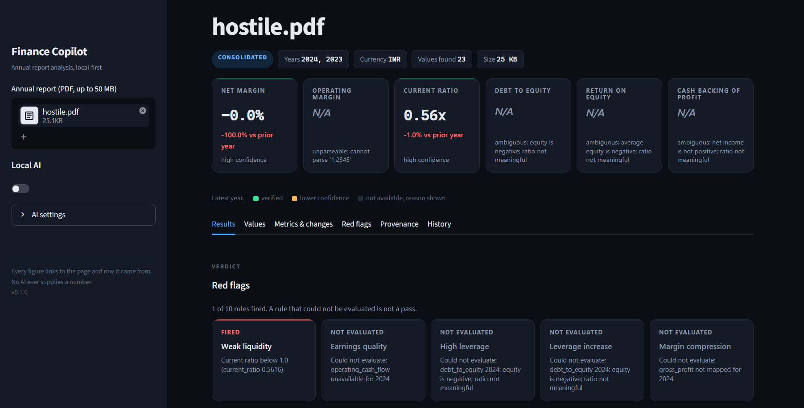

# Finance Copilot

A local tool that reads a company's annual report (PDF) and shows a trustworthy
financial analysis: the key numbers, the ratios, how they changed year over year,
whether the statements add up, and a list of warning signs. Every number on screen
can be traced to the exact row on the exact page it came from. Nothing is guessed,
and no AI ever supplies a number.



**Status:** Phases 0-13 complete. Runs entirely on your machine; no data leaves it.
Validated on three real annual reports (Apple, Berkshire Hathaway, Wipro), see
[docs/PHASE12_VALIDATION.md](docs/PHASE12_VALIDATION.md).

---

## Quick start

```bash
uv sync --dev
uv run streamlit run app.py
```

Then open http://localhost:8501, upload a PDF, or press **Load sample report**.

Command line, no browser:

```bash
uv run python demo.py your_report.pdf
```

Tests and lint:

```bash
uv run pytest
uv run ruff check . && uv run ruff format --check .
```

## What the dashboard shows

The **Results** tab leads with the verdict, then draws the evidence.

| Panel | What it is |
|---|---|
| KPI cards | Latest-year net margin, operating margin, current ratio, debt to equity, return on equity, cash backing of profit. Green = verified; amber = usable but lower confidence; grey dashed = not available, with the reason printed. The change against the prior year is coloured by whether it is good news, not by its sign. |
| Red flag grid | Ten rules, each a card: fired, clear, or not evaluated with the reason. "Checked and fine" is never confused with "could not check". |
| Revenue and profit | Revenue down to net income, per year, in the report's own units. |
| Margins | Gross, operating and net margin per year. |
| Balance sheet | Assets beside liabilities plus equity. The two bars must reach the same height; a visible gap is the accounting identity failing. |
| Cash | A waterfall from operating cash flow, less capital expenditure, to free cash flow. |
| Cross-checks | Each check's difference drawn inside the tolerance it is allowed. No visible bar means the statement tied out exactly. |
| Values, Metrics, Provenance, History | The same results as tables, plus the page, table, row, column, raw text, scale and currency behind any figure, and past analyses from a local SQLite file. |

Every chart has **Show the numbers behind this chart** beneath it, and states in words
anything it could not draw. A value that is unavailable is absent from the chart, never
plotted as a zero bar.





Values that could not be determined are never blank or zero. They are greyed out and
carry the reason:



## Optional local AI

Switch on **Local AI (Ollama)** in the sidebar (needs [Ollama](https://ollama.com)
with `qwen2.5:3b` or any model you name). It is used for exactly two things:

1. **Picking a row** the exact-match tables could not name. It sees row labels and
   IDs only, never numbers, and its answer is checked six ways before use.
2. **Writing a plain-English reading** of the analysis. It sees a structured summary
   of the results, never the PDF. Every sentence must cite result IDs that exist, and
   every number it writes must be one it was shown. One fabricated figure rejects the
   whole narrative. Markdown and HTML are refused.

Switch it off and nothing else changes.

## The rules the system is built on

1. **Numbers come only from the document.** A financial value cannot be constructed
   without a pointer to the PDF cell it came from.
2. **Nothing is guessed.** Anything undeterminable is an explicit "unavailable" with a
   reason and a chain back to the first cause.
3. **The AI is optional and narrow**, and its output is text, never a number.
4. **Provenance survives every step.** Page -> cell -> number -> concept -> ratio ->
   red flag -> narrative sentence.

## Supported reports

Indian (Ind AS, rupees in crore or lakh, "FY 2023-24" years) and US (US GAAP, dollars
in millions, three years of operations against two balance sheets). Statements may be
ruled tables or plain whitespace-aligned text; page-split statements are rejoined; a
Notes column or a convenience-translation column is ignored. Scanned (image-only) PDFs
are rejected; there is no OCR. No currency conversion, ever.

## Limits, stated plainly

- Real reports still leave some lines unmapped, on purpose: a total printed with no
  label, two rows that both claim a concept, a label no alias table knows. Each is
  reported with its reason rather than guessed. Details and examples in
  [docs/PHASE12_VALIDATION.md](docs/PHASE12_VALIDATION.md).
- A 480-page report takes about 90 seconds on a laptop.
- Two-period documents give a year-over-year *change*, deliberately not a "trend".
- The full list of open items is in [docs/KNOWN_ISSUES.md](docs/KNOWN_ISSUES.md).

## Where things live

```
app.py                       the dashboard (UI wiring only)
pipeline.py                  the stages, in order, and nothing else
demo.py                      run an analysis and print it
src/fincopilot/types.py      every data contract
src/fincopilot/extract/      PDF gate, statement finding, text-grid parsing, periods, units
src/fincopilot/mapping/      row label -> concept, claim validation
src/fincopilot/ai/           Ollama client, row picker, grounded narrative
src/fincopilot/calc/         derived values, ratios, changes, reconciliation
src/fincopilot/rules/        red-flag rules and thresholds
src/fincopilot/views.py      dashboard rows and cards (pure, tested)
src/fincopilot/store.py      SQLite history
tests/fixtures/              nine generated PDFs with hand-computed answers
docs/                        design spec, build notes, validation, security review
```

Further reading: [docs/HOW_IT_WAS_BUILT.md](docs/HOW_IT_WAS_BUILT.md),
[docs/SECURITY_REVIEW.md](docs/SECURITY_REVIEW.md).
